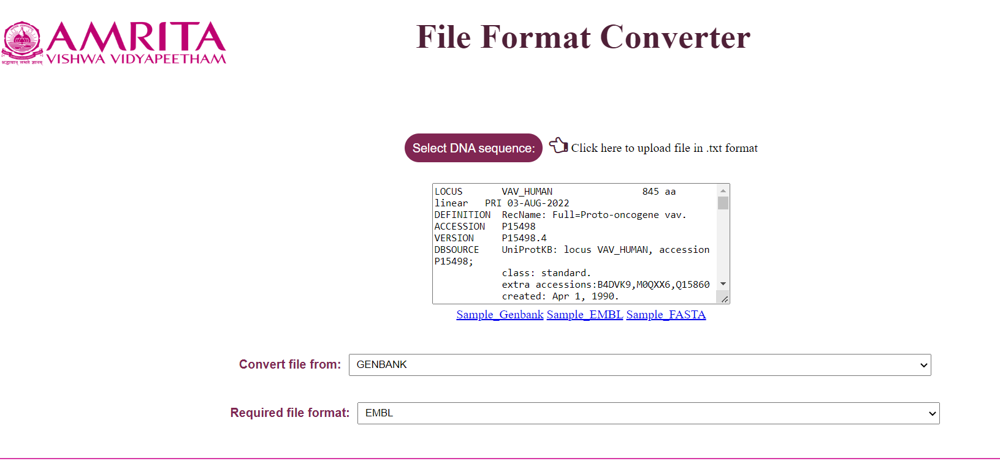

### Procedure to Work Simulator

The File Format Converter converts nucleotide file formats from GenBank to FASTA and EMBL to FASTA.

&nbsp;
### GenBank to FASTA

1.	Open the simulator to convert a biological sequence from one format to the other

 &nbsp;

 
2.	Upload any file which needs to be converted by clicking on the “Choose file“ button

 &nbsp;
 
 Sample files for each of the file formats are provided which can be downloaded
 
 

 &nbsp;
 
 
3. If the file type is known, select the file type from the dropdown for “Convert file from:”. If it is unknown during the submission, it would be selected automatically. As the file is loaded the contents of the file are displayed in the text area.
 

 &nbsp;
 

 &nbsp;

4.	Select the required file type from the dropdown for “Required file format:”. 
 
 

 &nbsp;
 
5.	Click on “Submit”; the FASTA file format will be displayed in the text area which can be downloaded by clicking on the “Download result”.

 &nbsp;
 

 &nbsp;
