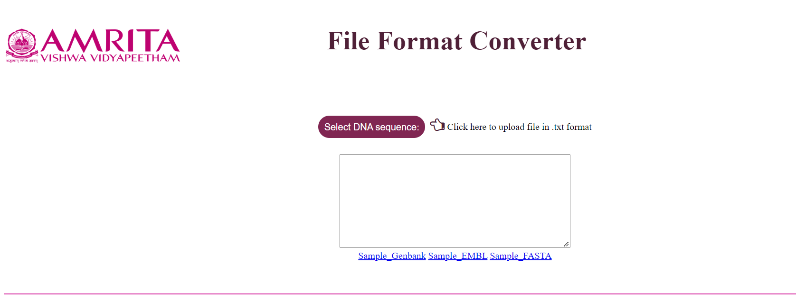
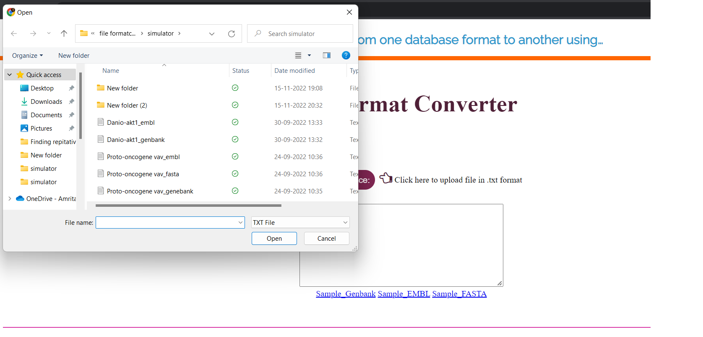
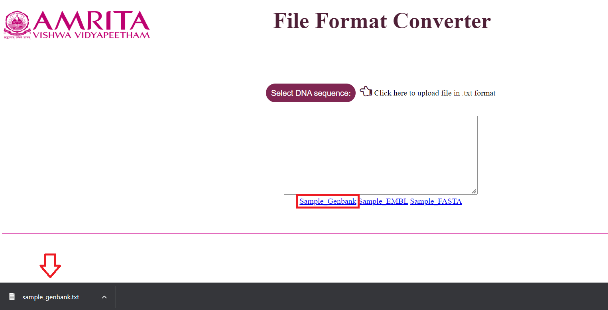
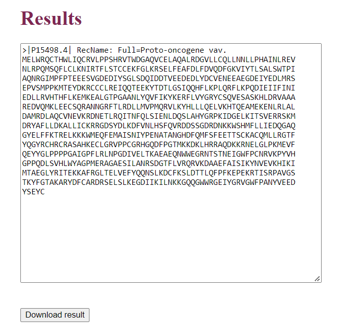

### Procedure to Work Simulator

The File Format Converter converts nucleotide file formats from GenBank to FASTA and EMBL to FASTA.

&nbsp;
### GenBank to FASTA

1.	Open the simulator to convert a biological sequence from one format to the other

 &nbsp;

 
2.	Upload any file which needs to be converted by clicking on the “Select DNA sequence:“ button

 &nbsp;
 
 Sample files for each of the file formats are provided which can be downloaded
 
 

 &nbsp;
 
 
3. As the file is loaded the contents of the file are displayed in the text area. Simultaneously the dropdown menu for the file formats would also appear. By default the uploaded file format is selected in the "Convert file from:" dropdown menu but there is also a option to manually change the option.  
 

 &nbsp;
 

 &nbsp;

4.	Select the required file type from the dropdown for “Required file format:”. 
 
 

 &nbsp;
 
5.	The FASTA file format will be displayed in the text area which can be downloaded by clicking on the “Download result”.

 &nbsp;
 

 &nbsp;
