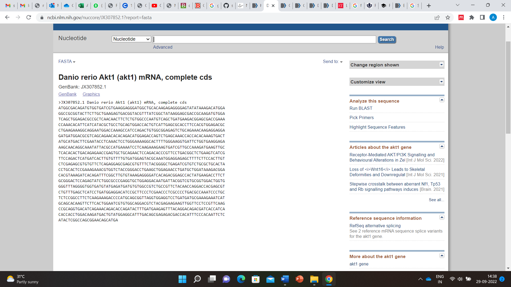
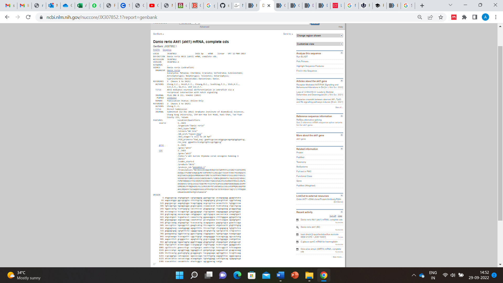
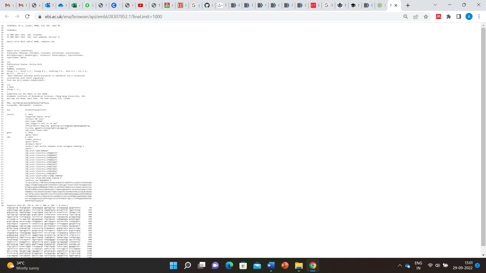

&nbsp;
### Introduction
&nbsp;

A biological sequence represents a single, continuous molecule of nucleic acid (DNA, RNA) or protein. A database refers to a structured collection of information for providing data in a computer-readable form. In the case of a protein database, it explains basic units of the given protein, and properties of proteins such as the name of the protein, length, and specific amino acid sequences. File formats are important for storing managing and exchanging data in science and engineering communities. Basically, a file format is a standard method for encoding biological information that can be stored as a computer file. In a broader sense, it is noted that file formats extend to achieve uniformity in the presentation of biological sequences. Recent advances in software tools for analyzing biological information marked the need for standard file formats for the usage and exchange of biological data for educational and research purposes. Various bioinformatics software has been explored for solving the difficulties associated with encoding complicated genomic knowledge which demands a distinct sequence format. A number of file formats for representing nucleotides (DNA and RNA) and protein were available in public domains. 

&nbsp;

### Overview of File formats used in Bioinformatics
&nbsp;

A file format, often known as a file extension, represents structured data within a computer file so that software can access and understand data, and properly understand the data that can process it further. In bioinformatics, for example for sequence analysis, there exists different file formats such as alignment file formats and annotation file formats.

A few advantages of file formats in bioinformatics are listed:

   •	File formats were developed with specific purposes for providing compatibility per specific software in computational research. Examples included structure vsualizations diagrams and mappings of biological sequences.

   •	Easiness in data processing efficiency.

   •	Quick readability and accessibility.
 
&nbsp;

### Description on Sequence File Formats in Bioinformatics

As discussed, in the field of bioinformatics, there were many different file formats exists to store DNA and protein sequence information. DNA and RNA use 1 letter codes that represents the bases (A Adenine, T, Thymine, Uracil (U) in RNA instead of T, G-Guanine and C-Cytosine,) in a sequence format. Proteins are molecules with amino acids as building blocks and each protein differ from other with respect to their amino acid sequence. Amino acids were represented either by three-letter codes or by one-letter codes.G (Glycine Gly), P (Proline Pro), A (Alanine Ala),  V (Valine Val), L (Leucine Leu), I (Isoleucine Ile), M (Methionine Met), C (Cysteine Cys), F (Phenylalanine Phe), Y (Tyrosine Tyr), W (Tryptophan Trp), H (Histidine His), K (Lysine Lys), R (Arginine Arg), Q (Glutamine Gln), N (Asparagine Asn), E (Glutamic Acid Glu), D (Aspartic Acid Asp), S (Serine Ser), T (Threonine Thr).

Example of a DNA sequence: **ATCGGTGACTATCGCATCGTTAACCTCTT**

Example of a Protein sequence:  **GIVEQCCTSICSLYQLENYCN **

&nbsp;
### Commonly used FILE FORMATS

&nbsp;
&nbsp;

**1.	FASTA FORMAT**

The FASTA format is a ubiquitous text-based format invented in 1988 for representing either nucleotide sequences or peptide sequences, in which base pairs or amino acids are represented using single-letter codes. A sequence in FASTA format begins with a single-line description, followed by lines of sequence data. The first line in a FASTA file starts with a ">" (greater-than) symbol followed by the description or identifier of the sequence. Following the initial line (used for a unique description of the sequence) is the actual sequence itself in standard one-letter code. The file extensions .fa, .fasta, or .fna are commonly used for FASTA files, with the latter indicating that they are nucleotide files.

An example of sample sequence is:
\>KX580312.1 Homo sapiens truncated breast cancer 1 (BRCA1) gene, exon 15 and partial GTCATCCCCTTCTAAATGCCCATCATTAGATGATAGGTGGTACATGCACAGTTGCTCTGGGAGTCTTCAGAATAGAAACTACCCATCTCAAGAGGAGCTCATTAAGGTTGTTGATGTGGAGGAGTAACAGCTGGAAGAGTCTGGGCCACACGATTTGACGGAAACATCTTACTTGCCAAGGCAAGATCTAG

&nbsp;

A FASTA file can contain multiple sequences. Each sequence will be separated by its "header" line, starting with ">".

Example:

 Figure 1: FASTA file format for the Akt1 mRNA sequence for the organism Danio rerio 

&nbsp;
&nbsp;

**2.	FASTQ FORMAT**

The FASTQ format is also a text-based format to represent nucleotide sequences, but also contains the corresponding quality of each nucleotide. It is the standard for storing the output of high-throughput sequencing instruments such as the Illumina machines.
An example sequence in FASTQ format:

@SEQ_ID  

GATTTGGGGTTCAAAGCAGTATCGATCAAATAGTAAATCCATTTGTTCAACTCACAGTTT  

\+ 

!''*((((***+))%%%++)(%%%%).1***-+*''))**55CCF>>>>>>CCCCCCC65

A FASTQ file uses four lines per sequence: 

•	Line 1 begins with a '@' character and is followed by a sequence identifier and an optional description (like a FASTA title line). 

•	Line 2 is the raw sequence. 

•	Line 3 begins with a '+' character and is optionally followed by the same sequence identifier (and any description) again. 

•	Line 4 encodes the quality values for the sequence in Line 2 and must contain the same number of symbols as in the sequence. 

&nbsp;
&nbsp;

**3.	GENBANK FILE FORMAT**

The Genbank format contains experimental information in addition to the DNA/protein sequence. It holds much more information than the FASTA format. A sequence file in GenBank format can contain several sequences. GenBank format starts with the word “LOCUS” line and is followed by other annotations. The start of the sequence is marked by a line containing "ORIGIN" and the end of the sequence is marked by two slashes ("//"). The Genbank file format is quite flexible and allows annotations, comments, and references to be included within the file. The file is plain text and thus can be read with a text editor. GenBank files often have the file extension '.gb' or '.genbank'.
An example of GenBank sequence is shown below: 

 Figure 2: GenBank file format for the Akt1 mRNA sequence for the organism Danio rerio

&nbsp;
&nbsp;

**4.	EMBL FORMAT**

EMBL is a file format used to represent DNA and protein sequence and is used by various DNA sequence programs. Each EMBL file contains sequence data, along with information about the sequence, such as the name, type, and description. EMBL files can store multiple sequences. An EMBL file consists of individual sequence entries. The EMBL (European Molecular Biology Laboratory) Nucleotide Sequence Database (http://www.ebi.ac.uk/embl/index.html) is a comprehensive collection of primary nucleotide sequences maintained at the European Bioinformatics Institute (EBI).
EMBL format is almost similar to the Genbank file format. A sequence file in EMBL format can contain several sequences. One sequence entry starts with an identifier line ("ID"), followed by further annotation lines. The start of the sequence is marked by a line starting with "SQ" and the end of the sequence is marked by two slashes ("//").

An example of EMBL sequence is shown below:
 

 
 
 
 
Figure 3: EMBL file format for the Akt1 mRNA sequence for the organism Danio rerio

Explanation:

•	The ID (IDentification line) line is always the first line of an entry. 

•	The XX line contains no data or comments. It is used instead of blank lines to avoid confusion with the sequence data lines. 

•	The AC (Accession Number) line lists the accession numbers associated with this entry. 

•	The DT (Date) line shows when an entry appeared in the database and when it was last updated. 

•	The DE (DEscription) lines contain general descriptive information about the sequence stored. 

•	The KW (KeyWord) lines provide information that can be used to generate cross-reference indexes of the sequence entries based on functional, structural, or other categories deemed important. The keywords chosen for each entry serve as a subject reference for the sequence and will be expanded as work with the database continues. Often several KW lines are necessary for a single entry. 

•	The OS (Organism Species) line specifies the preferred scientific name of the organism which was the source of the stored sequence. 

•	The OC (Organism Classification) lines contain the taxonomic classification of the source organism. 

•	The RN (Reference Number) line gives a unique number to each reference citation within an entry.  

•	The RC (Reference Comment) line type is an optional line type that appears if the reference has a comment. 

•	The RP (Reference Position) line type is an optional line type that appears if one or more contiguous base spans of the presented sequence can be attributed to the reference in question. 

•	The RX (Reference Cross-reference) line type is an optional line type which contains a cross-reference to an external citation or abstract database. 

•	The RA (Reference Author) lines list the authors of the paper (or other work) cited. 

•	The RT (Reference Title) lines give the paper’s title (or other work). 

•	The RL (Reference Location) line contains the conventional citation information for the reference. 

•	The DR (Database Cross-Reference) line cross-references other databases which contain information related to the entry in which the DR line appears. 

•	The CC lines are free text comments about the entry and may be used to convey any sort of information thought to be useful. 

•	The FH (Feature Header) lines are present only to improve the readability of an entry when it is printed or displayed on a terminal screen. The lines contain no data and may be ignored by computer programs. 

•	The FT (Feature Table) lines provide a mechanism for annotating the sequence data. Regions or sites in the sequence of interest are listed in the table. 

•	The SQ (Sequence header) line marks the beginning of the sequence data and gives a summary of its content. 

•	The sequence data lines have lines of code starting with two blanks. The sequence is written 60 bases per line, in groups of 10 bases separated by a blank character, beginning in position 6 of the line. The direction listed is always 5' to 3'. 

•	The // (terminator) line also contains no data or comments. It designates the end of an entry. 

&nbsp;
&nbsp;

### Other File Formats in Bioinformatics include

1. ABI-binary file format containing sanger sequencing sequence and trace data.

2. MDL- contains information regarding small molecules (2D structure data)

3. SFF(Standard flowgram format) - binary file format

&nbsp;

<b>List of Abbreviations</b>
   
Deoxyribonucleic acid - DNA

Ribonucleic acid - RNA  

European Molecular Biology Laboratory - EMBL

European Bioinformatics Institute -EBI

DNA Data Bank of Japan - DDBJ

Protein Data Bank –PDB

Protein Information Resource -PIR

Next-generation sequencing -NGS

Sequence Alignment and Map -SAM

Binary Alignment and Map -BAM

General Feature Format -GFF

National Biomedical Research Foundation -NBRF
