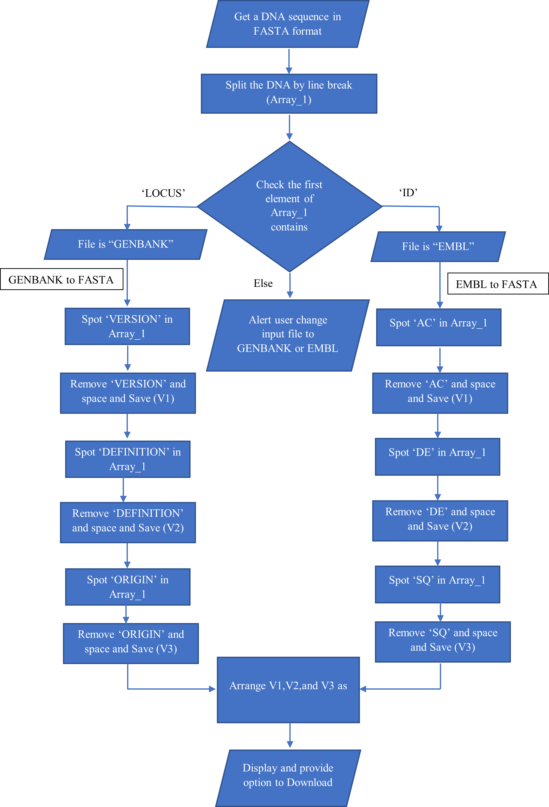

<b>List of Abbreviations</b>

            Deoxyribonucleic acid - DNA
      Ribonucleic acid - RNA  
      European Molecular Biology Laboratory - EMBL
      European Bioinformatics Institute -EBI
      DNA Data Bank of Japan - DDBJ
      Protein Data Bank –PDB
      Protein Information Resource -PIR
      Next-generation sequencing -NGS
      Sequence Alignment and Map -SAM
      Binary Alignment and Map -BAM
      General Feature Format -GFF
      National Biomedical Research Foundation -NBRF
   

&nbsp;

## Introduction
&nbsp;
A biological sequence represents a single, continuous molecule of nucleic acid (DNA, RNA) or protein. These sequences become meaningful when they are annotated and stored in different databases. A database is a structured collection of data that can be read and retrieved when required. In the case of protein databases, it explains the basic units of a given protein and properties of proteins, such as the name of the protein, length, and specific amino acid sequences. All the annotations need to be displayed uniformly so that the data becomes understandable for anybody who wants to know more about the data. File formats were brought to create this uniformity among the scientific community. In a broader sense, it is noted that file formats extend to achieve uniformity in the presentation of biological sequences. These formats are essential for storing, managing, and exchanging data in science and engineering communities. A file format is a standard method for encoding biological information that can be stored as a computer file. Recent advances in software tools for analyzing biological information marked the need for common file formats for the usage and exchange of biological data for educational and research purposes. Various bioinformatics software has been explored to solve the difficulties associated with encoding complicated genomic knowledge that demands a distinct sequence format. Several file formats for representing nucleotides (DNA and RNA) and proteins were available in public domains.
&nbsp;

#### Overview of File formats used in Bioinformatics
&nbsp;
Bioinformaticians created a plethora of bioinformatics software throughout the year to solve the difficulties associated with encoding complicated genomic knowledge. Depending on the circumstances, the bioinformatics tool demands a distinct sequence format. Every tool uses a specific set of formats for processing. Thus, there is a need for sequence file format conversion. Several file formats representing nucleotides (DNA and RNA) and proteins were available in public domains.

A file format, often known as a file extension, refers to how data is structured within a file on a computer. File formatting enables software to access data, properly understand the data, and continue with processing. A series of file formats known as biological file formats are used since it is now possible to store enormous biological data digitally. The file formats used in bioinformatics and genome sequence analysis methods include different data file formats, alignment file formats, and annotation file formats. Each data file format was developed with its purposes in computational research. Some of the advantages of these file formats are:

     • Compatibility per specific software (for visualizations, diagrams, and mappings).

     • Simple text for easy data processing, parsing, and human readability.

     • Improve efficiency for computers. 

#### Some Sequence File Formats in Bioinformatics

As discussed, in the field of bioinformatics, there were many different file formats exist to store DNA, RNA, and protein sequence information. DNA and RNA use 1-letter codes that represent the bases (A Adenine, T, Thymine, Uracil (U) in RNA instead of T, G-Guanine, and C-Cytosine,) in a sequence format. Proteins are molecules with amino acids as building blocks, and each protein differs from others with respect to its amino acid sequence. Amino acids were represented either by three-letter codes or by one-letter codes. G (Glycine Gly), P (Proline Pro), A (Alanine Ala),  V (Valine Val), L (Leucine Leu), I (Isoleucine Ile), M (Methionine Met), C (Cysteine Cys), F (Phenylalanine Phe), Y (Tyrosine Tyr), W (Tryptophan Trp), H (Histidine His), K (Lysine Lys), R (Arginine Arg), Q (Glutamine Gln), N (Asparagine Asn), E (Glutamic Acid Glu), D (Aspartic Acid Asp), S (Serine Ser), T (Threonine Thr).

Example of a DNA sequence: **ATCGGTGACTATCGCATCGTTAACCTCTT**

Example of a Protein sequence: **GIVEQCCTSICSLYQLENYCN**
&nbsp;

### Commonly used FILE FORMATS
&nbsp;
**1.	FASTA FORMAT**

The FASTA format is a ubiquitous text-based format invented in 1988 for representing either nucleotide sequences or peptide sequences, in which base pairs or amino acids are represented using single-letter codes. A sequence in FASTA format begins with a single-line description, followed by lines of sequence data. The first line in a FASTA file starts with a ">" (greater-than) symbol followed by the description or identifier of the sequence. Following the initial line (used for a unique description of the sequence) is the actual sequence itself in standard one-letter code. The file extensions .fa, .fasta, or .fna are commonly used for FASTA files, with the latter indicating that they are nucleotide files.

An example of sample sequence is:

\>KX580312.1 Homo sapiens truncated breast cancer 1 (BRCA1) gene, exon 15 and partial GTCATCCCCTTCTAAATGCCCATCATTAGATGATAGGTGGTACATGCACAGTTGCTCTGGGAGTCTTCAGAATAGAAACTACCCATCTCAAGAGGAGCTCATTAAGGTTGTTGATGTGGAGGAGTAACAGCTGGAAGAGTCTGGGCCACACGATTTGACGGAAACATCTTACTTGCCAAGGCAAGATCTAG

&nbsp;

A FASTA file can contain multiple sequences. Each sequence will be separated by its "header" line, starting with ">".

**Example:**

 Figure 1: FASTA file format for the Akt1 mRNA sequence for the organism _Danio rerio _
 

&nbsp;
&nbsp;

**2.	FASTQ FORMAT**

The FASTQ format is also a text-based format to represent nucleotide sequences, but also contains the corresponding quality of each nucleotide. It is the standard for storing the output of high-throughput sequencing instruments such as the Illumina machines.
An example sequence in FASTQ format:

@SEQ_ID  
GATTTGGGGTTCAAAGCAGTATCGATCAAATAGTAAATCCATTTGTTCAACTCACAGTTT  
\+ 
!''*((((***+))%%%++)(%%%%).1***-+*''))**55CCF>>>>>>CCCCCCC65

A FASTQ file uses four lines per sequence: 

      •	Line 1 begins with a '@' character and is followed by a sequence identifier and an optional description (like a FASTA title line). 

      •	Line 2 is the raw sequence. 

      •	Line 3 begins with a '+' character and is optionally followed by the same sequence identifier (and any description) again. 

      •	Line 4 encodes the quality values for the sequence in Line 2 and must contain the same number of symbols as in the sequence. 

&nbsp;
&nbsp;

**3.	GENBANK FILE FORMAT**

The Genbank format contains experimental information in addition to the DNA/protein sequence. It holds much more information than the FASTA format. A sequence file in GenBank format can contain several sequences. GenBank format starts with the word “LOCUS” line and is followed by other annotations. The start of the sequence is marked by a line containing "ORIGIN" and the end of the sequence is marked by two slashes ("//"). The Genbank file format is quite flexible and allows annotations, comments, and references to be included within the file. The file is plain text and thus can be read with a text editor. GenBank files often have the file extension '.gb' or '.genbank'.
An example of GenBank sequence is shown below: 

   Figure 2: GenBank file format for the Akt1 mRNA sequence for the organism _Danio rerio_
   

&nbsp;
&nbsp;

Each tag in the Genbank format is briefly described below:

•	**LOCUS:** The LOCUS field contains a number of different data elements, including locus name, sequence length, molecule type, GenBank division, and modification date. The locus name was originally designed to help group entries with similar sequences: the first three characters usually designated the organism; the fourth and fifth characters were used to show other group designations, such as gene product; for segmented entries, the last character was one of a series of sequential integers. However, the 10 characters in the locus name are no longer sufficient to represent the amount of information originally intended to be contained in the locus name. The only rule now applied in assigning a locus name is that it must be unique. For example, for GenBank records that have 6-character accessions (e.g., U12345), the locus name is usually the first letter of the genus and species names, followed by the accession number. For 8-character, character accessions (e.g., AF123456), the locus name is just the accession number.

•	**SEQUENCE LENGTH:** Number of nucleotide base pairs (or amino acid residues) in the sequence record. In this example, the sequence length is 1425bp.There is no maximum limit on the size of a sequence that can be submitted to GenBank. We can submit a whole genome if we have a contiguous piece of sequence from a single molecule type. However, there is a limit of 350 kb on an individual GenBank record. That limit was agreed upon by the international collaborating sequence databases to facilitate handling of sequence data by various software programs. The minimum length required for submission is 50 bp.

•	**MOLECULE TYPE:** The type of molecule that was sequenced. In this example, the molecule type is mRNA. Each GenBank record must contain contiguous sequence data from a single molecule type. The various molecule types are described in the Sequin documentation and can include genomic DNA, genomic RNA, precursor RNA, mRNA (cDNA), ribosomal RNA, transfer RNA, small nuclear RNA, and small cytoplasmic RNA.

•	**GENBANK DIVISION:** The GenBank division to which a record belongs is indicated with a three letter abbreviation. In this example, GenBank division is VRT. The GenBank database is divided into 18 divisions:
   1.	PRI - primate sequences
   2.	ROD - rodent sequences
   3.	MAM - other mammalian sequences
   4.	VRT - other vertebrate sequences
   5.	INV - invertebrate sequences
   6.	PLN - plant, fungal, and algal sequences
   7.	BCT - bacterial sequences
   8.	VRL - viral sequences
   9.	PHG - bacteriophage sequences
   10.	SYN - synthetic sequences
   11.	UNA - unannotated sequences
   12.	EST - EST sequences (expressed sequence tags)
   13.	PAT - patent sequences
   14.	STS - STS sequences (sequence tagged sites)
   15.	GSS - GSS sequences (genome survey sequences)
   16.	HTG - HTG sequences (high-throughput genomic sequences)
   17.	HTC - unfinished high-throughput cDNA sequencing
   18.	ENV - environmental sampling sequences

•	**MODIFICATION DATE:** The date in the LOCUS field is the date of last modification. The sample record shown here was last modified on 12-MAR-2013.

•	**DEFINITION:** Definition means the brief description of sequence; ie information such as source organism, gene name/protein name, or some description of the sequence's function (if the sequence is non-coding). If the sequence has a coding region (CDS), description may be followed by a completeness qualifier, such as "complete cds".

•	**ACCESSION:** The unique identifier for a sequence record. An accession number applies to the complete record and is usually a combination of a letter(s) and numbers, such as a single letter followed by five digits (e.g., U12345) or two letters followed by six digits (e.g., JX307852). Some accessions might be longer, depending on the type of sequence record. 

•	**VERSION:** A nucleotide sequence identification number that represents a single, specific sequence in the GenBank database. This identification number uses the accession.version format implemented by GenBank/EMBL/DDBJ in February 1999.If there is any change to the sequence data (even a single base), the version number will be increased,e.g., U12345.1 → U12345.2, but the accession portion will remain stable. 

•	**KEYWORDS:** Word or phrase describing the sequence. If no keywords are included in the entry, the field contains only a period. Keywords are generally present in older records. They are not included in newer records unless: (1) they are not redundant with any feature, qualifier, or other information present in the record; or (2) the submitter specifically asks for them to be added and #1 is true; or (3) the record contains a special type of sequence such as EST, STS, GSS, HTG, etc.

•	**SOURCE:** Free-format information including an abbreviated form of the organism name, sometimes followed by a molecule type.

•	**ORGANISM:** The formal scientific name for the source organism (genus and species) and its lineage, based on the phylogenetic classification scheme were described in the tag.

•	**REFERENCE:** Publications by the authors of the sequence that discuss the data reported in the record. References are automatically sorted within the record based on date of publication, showing the oldest references first. Various classes of publication can be present in the References field, including journal article, book chapter, book, thesis/monograph, proceedings chapter, proceedings from a meeting, and patent.

•	**AUTHORS:** List of authors in the order in which they appear in the cited article.

•	**TITLE:** Title of the published work or tentative title of an unpublished work.

•	**PUBMED:** PubMed Identifier (PMID): References that include PubMed IDs contain links from the sequence record to the corresponding PubMed record. 

•	**FEATURES:** Information about genes and gene products, as well as regions of biological significance reported in the sequence. These can include regions of the sequence that code for proteins and RNA molecules, as well as a number of other features.

•	**SOURCE:** Mandatory feature in each record that summarizes the length of the sequence, scientific name of the source organism, and Taxon ID number. Can also include other information such as map location, strain, clone, tissue type, etc., if provided by submitter.

•	**TAXON:** A stable unique identification number for the taxon of the source organism. A taxonomy ID number is assigned to each taxon (species, genus, family, etc.) in the NCBI Taxonomy Database.

•	**.CDS:** Coding sequence; region of nucleotides that corresponds with the sequence of amino acids in a protein (location includes start and stop codons). The CDS feature includes an amino acid translation. Authors can specify the nature of the CDS by using the qualifier "/evidence=experimental" or "/evidence=not_experimental". Submitters are also encouraged to annotate the mRNA feature, which includes the 5' untranslated region (5'UTR), coding sequences (CDS, exon), and 3' untranslated region (3'UTR).

•	**ORIGIN:** The ORIGIN tag represents the sequence data which is displayed in the next sequence. The ORIGIN may be left blank, may appear as "Unreported," or may give a local pointer to the sequence start, usually involving an experimentally determined restriction cleavage site or the genetic locus. This information is present only in older records.  

**4.	EMBL FORMAT**

EMBL is a file format used to represent DNA and protein sequence and is used by various DNA sequence programs. Each EMBL file contains sequence data, along with information about the sequence, such as the name, type, and description. EMBL files can store multiple sequences. An EMBL file consists of individual sequence entries. The EMBL (European Molecular Biology Laboratory) Nucleotide Sequence Database (http://www.ebi.ac.uk/embl/index.html) is a comprehensive collection of primary nucleotide sequences maintained at the European Bioinformatics Institute (EBI).
EMBL format is almost similar to the Genbank file format. A sequence file in EMBL format can contain several sequences. One sequence entry starts with an identifier line ("ID"), followed by further annotation lines. The start of the sequence is marked by a line starting with "SQ" and the end of the sequence is marked by two slashes ("//").

An example of EMBL sequence is shown below:

 
Figure 3: EMBL file format for the Akt1 mRNA sequence for the organism _Danio rerio_
   
   

   
   

Explanation:

      •	The **ID** (IDentification line) line is always the first line of an entry. 

      •	The **XX** line contains no data or comments. It is used instead of blank lines to avoid confusion with the sequence data lines. 

      •	The **AC** (Accession Number) line lists the accession numbers associated with this entry. 

      •	The **DT** (Date) line shows when an entry appeared in the database and when it was last updated. 

      •	The **DE**(DEscription) lines contain general descriptive information about the sequence stored. 

      •	The **KW** (KeyWord) lines provide information that can be used to generate cross-reference indexes of the sequence entries based on functional, structural, or other categories deemed important. The keywords chosen for each entry serve as a subject reference for the sequence and will be expanded as work with the database continues. Often several KW lines are necessary for a single entry. 

      •	The **OS** (Organism Species) line specifies the preferred scientific name of the organism which was the source of the stored sequence. 

      •	The **OC** (Organism Classification) lines contain the taxonomic classification of the source organism. 

      •	The **RN**(Reference Number) line gives a unique number to each reference citation within an entry.  

      •	The **RC** (Reference Comment) line type is an optional line type that appears if the reference has a comment. 

      •	The **RP** (Reference Position) line type is an optional line type that appears if one or more contiguous base spans of the presented sequence can be attributed to the reference in question. 

      •	The **RX** (Reference Cross-reference) line type is an optional line type which contains a cross-reference to an external citation or abstract database. 

      •	The **RA** (Reference Author) lines list the authors of the paper (or other work) cited. 

      •	The **RT** (Reference Title) lines give the paper’s title (or other work). 

      •	The **RL** (Reference Location) line contains the conventional citation information for the reference. 

      •	The **DR** (Database Cross-Reference) line cross-references other databases which contain information related to the entry in which the DR line appears. 

      •	The **CC** lines are free text comments about the entry and may be used to convey any sort of information thought to be useful. 

      •	The **FH** (Feature Header) lines are present only to improve the readability of an entry when it is printed or displayed on a terminal screen. The lines contain no data and may be ignored by computer programs. 

      •	The **FT** (Feature Table) lines provide a mechanism for annotating the sequence data. Regions or sites in the sequence of interest are listed in the table. 

      •	The **SQ** (Sequence header) line marks the beginning of the sequence data and gives a summary of its content. . The sequence starts in the next line and is written 60 bases per line, in groups of 10 bases separated by a blank character, beginning in position 6 of the line. The direction listed is always 5' to 3'. 

      •	The **//**(terminator) line also contains no data or comments. It designates the end of an entry. 

&nbsp;
&nbsp;

**5.	Other Biological File Formats**

Biological data can also be represented in different formats based on the information required and the analysis carried out. EMBL is a file format used to represent DNA and protein sequence and is used by various DNA sequence programs. Specific tools use specific data formats to store a large amount of bioinformatic data. Some examples of data formats in bioinformatics are FASTA format, Genbank file format, EMBL format, Swiss-prot format, DDBJ format, GDE Format, NBRF/PIR Format, Multiple Sequence Alignment Data Format includes (GCG/MSF format and ALN/Clustal Format) Structural Data Format includes PDB Format, Annotation Data Formats includes GFF, GFF2, GFF3 Format, NGS Data Formats includes SAM/BAM Format, Annotation Data Formats includes FASTQ Format. Other file formats like

    SFF(Standard flowgram format) and ABI-binary file format containing sanger sequencing sequence and trace data.
   
    MDL- contains information regarding small molecules (2D structure data)

    SBML (System Biology Markup Language)- Contains list of reactants, products, reactions, enzymes etc. associated with a metabolic/ signalling pathway
 &nbsp;

 

### Algorithm to develop a file format simulator

#### Step 1: Problem Definition:

To convert the file format of a given biological sequence to another format which can be downloaded.

#### Step 2: Project Planning & System Definition:

DNA and protein sequences are stored in databases using different biological sequence file formats. The file formats (eg; EMBL, FASTA, GENBANK etc) differs in the presence of special characters and words that indicate where the detailed information as well as the sequence lies in the document. In this simulator we can convert EMBL or GENBANK file format to FASTA format.

#### Step 3: Model Formulation:

**Input Data Collection & Analysis:**
The DNA sequence can be in GENBANK or EMBL file format which can be obtained from different databases, saved as **.txt format** serves as the simulation's input data.

**Model Translation:**
Interface of the simulator can be developed in HTML as it is light weighted and fast to load, and every browser supports HTML. CSS was used to help style the html elements and JavaScript was used as the programming language to create dynamic and interactive web content.

